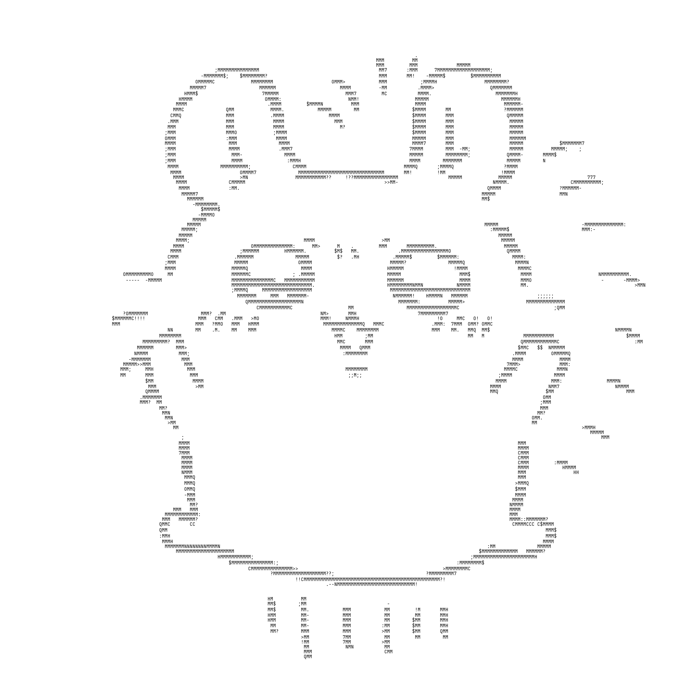
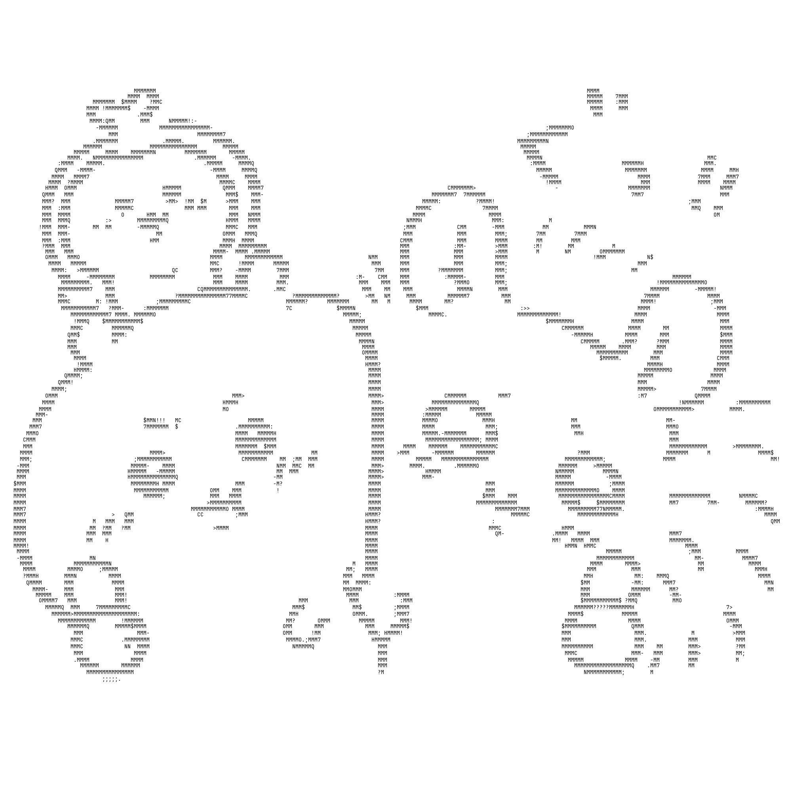

# img2chars

一个很简单的将图片转换为字符画的小玩意, 处理轮廓明显的图片效果较好.

### 效果

| before                                                  | after                                                            |
|---------------------------------------------------------|------------------------------------------------------------------|
|  |  |
|  |  |

### 使用

- 很简单, 可以直接看源代码, 有完整的注释, 也可以参考下面的示例

#### 安装依赖

```shell
pip install -r requirements.txt
```

#### 使用示例

```python
import img2chars

img = './images/demo_2.png'
output = img.rsplit('.', 1)[0] + '_chars_lg.png'

convertor = img2chars.Convertor(
    # 传入图片路径
    original_image_path=img,
    # 输出图片路径, 根据实际情况修改
    output_image_path=output,
    # 字符画颜色配置, 默认为黑底白字, 这里修改为白底黑字
    color=img2chars.Color(
        background=(255, 255, 255),
        text=(0, 0, 0),
    ),
    # 生成图大小级别, 默认为 Medium, 这里修改为 Large. 可以根据实际效果调整
    size=img2chars.Size(img2chars.Size.Large),
)

convertor.convert()
```